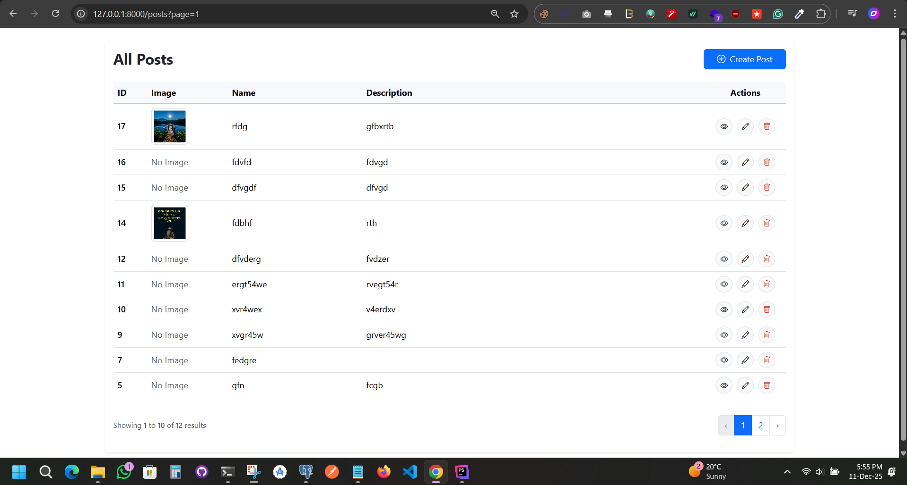

# Laravel Posts CRUD  
A clean and simple **Laravel CRUD Application** with image upload, pagination, validation, and Bootstrap UI.



---

## 🔰 Badges


---

## 📖 About the Project

This is a beginner-friendly yet production-ready **Laravel CRUD (Create, Read, Update, Delete)** project.  
It demonstrates:

- MVC architecture  
- Form Request validation  
- Pagination (Bootstrap styled)  
- Image upload using Laravel Storage  
- Clean UI and code structure  
- RESTful resource routes  

It’s perfect for learning Laravel MVC CRUD or using as a starter template.

---

## ✨ Features

- ✔️ Add Post  
- ✔️ Edit Post  
- ✔️ View Post  
- ✔️ Delete Post  
- ✔️ Image Upload  
- ✔️ Pagination  
- ✔️ Validation  
- ✔️ Bootstrap UI  
- ✔️ Clean, simple, reusable code  

---

## 🗂️ Project Structure

---

## 🛠️ Tech Stack

| Component | Technology |
|----------|------------|
| Backend | Laravel 10 |
| Language | PHP 8.1+ |
| Database | MySQL / PostgreSQL |
| Frontend | Blade + Bootstrap 5 |
| Storage | Laravel Filesystem |

---

## 🚀 Installation Guide

Follow these steps to run the project locally:

### 1️⃣ Clone the Repository
```bash
git clone <your-repo-url>
cd your-project-folder
composer install
cp .env.example .env
php artisan key:generate
DB_DATABASE=your_db
DB_USERNAME=your_user
DB_PASSWORD=your_pass
php artisan migrate
php artisan storage:link
php artisan serve


